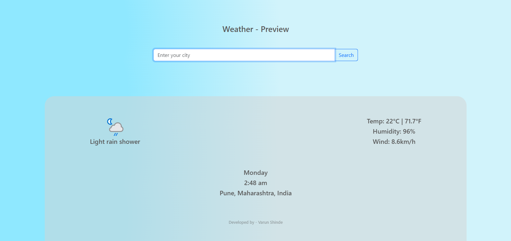

# 🌦️ Weather App

A simple weather forecast web application where users can search for a city and view real-time weather details such as **temperature, humidity, wind speed, and conditions**.  

---

## 🚀 Features
- Search any city worldwide 🌍
- Real-time weather data using an external API
- Displays:
  - Current temperature (°C / °F)
  - Humidity
  - Wind speed
  - Weather condition + icon
  - Location + local time
- Clean and responsive UI  

---

## 🛠️ Tech Stack
- **Frontend:** HTML, CSS, JavaScript  
- **Backend:** Node.js, Express.js  
- **API:** [OpenWeather API](https://openweathermap.org/)

---

## ⚙️ Setup & Installation

1. **Clone the repository**

   `git clone https://github.com/Varun04-pixel/Weather-app.git`
   
   `cd Weather-app`

3. **Install dependencies**

   `npm install`

5. **Add Environment Variables**

   -Create a .env file in the project root.

   -Add your Weather API key [visit openWeather for API Key](https://openweathermap.org/):

  `API_KEY = Your_API_key_here`
  
  `PORT = 3000`

4. **Run the server**

  `nodemon server.js`
